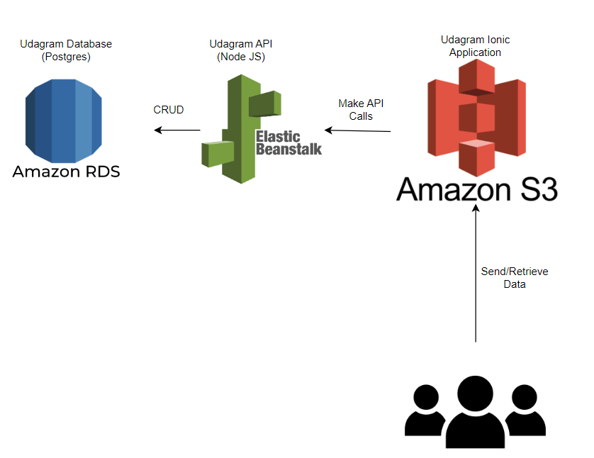

# Udagram Infrastructure Description

### AWS
#### Amazon RDS (Postgres)
To support our application API, we use AWS RDS to host our Postgres Database.

Database URL: `udagram-db.cpppoubr5ult.us-east-1.rds.amazonaws.com`

#### Elastic Beanstalk
The Node JS API was deployed to AWS Elastic Beanstalk.

API URL: `http://udagram-api-dev2.us-east-1.elasticbeanstalk.com/`

#### S3 Bucket
The frontend application was deployed to AWS S3 Bucket and was made publicly accessible by static hosting.

Frontend URL: `http://udagram-jerry-bucket.s3-website-us-east-1.amazonaws.com/`
