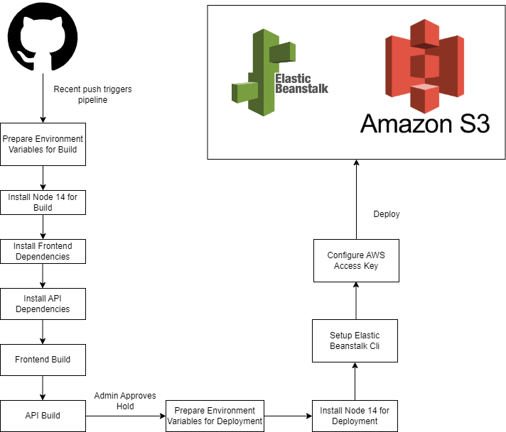

# CI/CD Pipeline

## CI/CD
#### GitHub
After developers commit and push their changes to the GitHub repository, the CircleCI platform will be triggered to start a new CI/CD pipeline, which is shwon in the figure above.

#### CircleCI
Again, the CircleCI platform is used for CI/CD in this project. The `.circleci/config.yml` describes the steps that need to be done for successful build and deployment of the project. The steps could include, and not limited to, building the frontend, building the API, linting the frontend, setting up AWS.